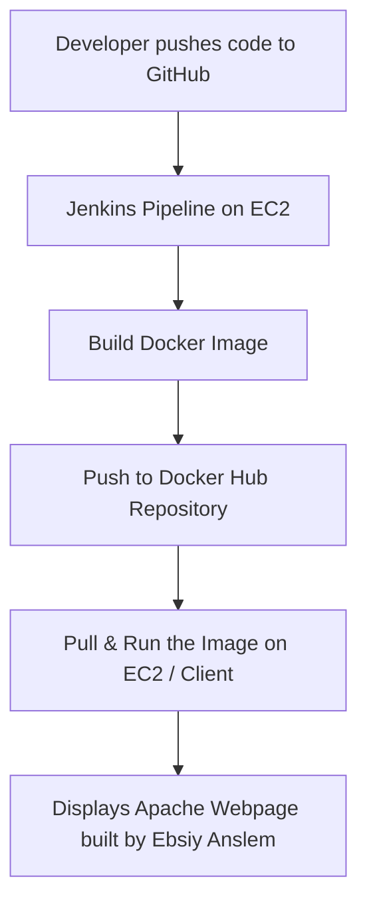

🚀 Jenkins CI/CD Pipeline: Build and Push Docker Image to Docker Hub
🧱 Project Overview

This project demonstrates a Continuous Integration and Continuous Deployment (CI/CD) pipeline using Jenkins, Docker, and GitHub.
The goal is to automate the process of building, testing, and pushing a Docker image to Docker Hub whenever new code is committed to the repository.

The pipeline uses a simple Dockerfile and index.html file to build an Apache webserver container image, which displays a custom message when accessed in a browser.

🧩 Objectives

Automate Docker image build and push using Jenkins.

Integrate Jenkins with Docker and Docker Hub.

Use GitHub as the source repository for version control.

Demonstrate a full CI/CD pipeline running on AWS EC2.

🏗️ Architecture

---
🧰 Tools and Technologies
- Tool	Purpose
Jenkins	CI/CD automation tool

Docker	Containerization platform

GitHub	Source code management

Docker Hub	Container registry

AWS EC2 (Ubuntu)	Jenkins host

HTML	Simple web content


#  Step-by-Step Implementation

## Launch Jenkins Server on EC2

1)Launch an Ubuntu EC2 instance (t2.micro or larger).

- Allow these inbound ports in your Security Group:

- Port 22 – SSH

- Port 8080 – Jenkins

- Port 80/8080 – Docker container testing

- Attach an IAM role with SSM role

## Install Jenkins
- Conect into the EC2 instance on session manager:
```bash
#🧩 INSTALL JENKINS ON UBUNTU EC2 (FOR DOCKER PIPELINE PROJECT)
# Step 1: Update system packages
sudo apt update -y
sudo apt install fontconfig openjdk-17-jre -y
# Step 2: Verify Java installation (required for Jenkins)
java -version

# Step 3: Add Jenkins repository key and source list
curl -fsSL https://pkg.jenkins.io/debian/jenkins.io-2023.key | sudo tee \
  /usr/share/keyrings/jenkins-keyring.asc > /dev/null

echo deb [signed-by=/usr/share/keyrings/jenkins-keyring.asc] \
  https://pkg.jenkins.io/debian binary/ | sudo tee \
  /etc/apt/sources.list.d/jenkins.list > /dev/null

# Step 4: Install Jenkins
sudo apt update -y
sudo apt install jenkins -y
# Step 5: Enable and start Jenkins service
sudo systemctl enable jenkins
sudo systemctl start jenkins
# Step 6: Check Jenkins status
sudo systemctl status jenkins
# Step 7: Allow Jenkins default port (8080) in firewall
sudo ufw allow 8080
sudo ufw allow OpenSSH
sudo ufw enable
sudo ufw status
# Step 8: Get initial Jenkins admin password
sudo cat /var/lib/jenkins/secrets/initialAdminPassword
# Copy this password and access Jenkins using:
# 👉 http://<EC2-Public-IP>:8080
# Step 9: Install suggested plugins and set up your admin user.
# Then proceed to create your first Jenkins pipeline.
```
---

## Install docker
```bash
# 🐳 INSTALL DOCKER ON UBUNTU EC2 FOR JENKINS PROJECT
# Step 1: Update package list
sudo apt update -y
# Step 2: Install prerequisite packages
sudo apt install ca-certificates curl gnupg lsb-release -y
# Step 3: Add Docker’s official GPG key
sudo mkdir -p /etc/apt/keyrings
curl -fsSL https://download.docker.com/linux/ubuntu/gpg | sudo gpg --dearmor -o /etc/apt/keyrings/docker.gpg
# Step 4: Add Docker repository
echo \
  "deb [arch=$(dpkg --print-architecture) signed-by=/etc/apt/keyrings/docker.gpg] \
  https://download.docker.com/linux/ubuntu \
  $(lsb_release -cs) stable" | sudo tee /etc/apt/sources.list.d/docker.list > /dev/null
# Step 5: Install Docker Engine, CLI, and Compose plugin
sudo apt update -y
sudo apt install docker-ce docker-ce-cli containerd.io docker-buildx-plugin docker-compose-plugin -y
# Step 6: Enable and start Docker service
sudo systemctl enable docker
sudo systemctl start docker
# Step 7: Verify Docker installation
docker --version
# Step 8: Add current user to the docker group (to avoid using sudo)
sudo usermod -aG docker $USER
newgrp docker
docker run hello-world
# ✅ Docker is ready! You can now build, tag, and push images from Jenkins.
```


## Access Jenkins
- After Jenkins starts, copy your EC2 public IP address and open:
- http://3.95.63.185:8080


- Retrieve the unlock key:
- sudo cat /var/lib/jenkins/secrets/initialAdminPassword
- Then copy and Paste this password on the unlock screen → choose Install Suggested Plugins → create your admin user → access the dashboard.

 

## Install Required Plugins
1)From the Jenkins dashboard:
- Go to Manage Jenkins → Plugins → Available Plugins
- Install:
- Docker
- Docker Pipeline
- Git
- Pipeline
- GitHub Integratio
- Credentials Binding
- pipeline stage view
-Restart Jenkins right after the installation
## Verify Docker runs for Jenkins:
```bash
sudo su - jenkins
docker --version
exit
```
## Add Docker Hub Credentials
- Go to:Dashboard → Manage Jenkins → Credentials → Global → Add Credentials
- so on jenkins,it will look like this:
```bash
Kind: Username with password
Username: anslem2025
Password: ************
ID: dockerhub-login
Description: Docker Hub access for Jenkins pipeline
```


## update and verify that your Jenkinsfile carries everything needed.
## Create and Run the Pipeline
```bash
Click New Item → select Pipeline
Name: DockerHub-CI-CD
Under Pipeline Definition, select Pipeline script from SCM
SCM: Git
Enter your GitHub repo URL
Branch: main
Script Path: Jenkinsfile
Click Save → Build Now
```


## Verify Results

Once the pipeline completes:

Go to Docker Hub


 Confirm your image appears under anslem2025/apache-webserver
- Test locally:
```
docker pull anslem2025/apache-webserver:latest
docker run -d -p 8080:80 anslem2025/apache-webserver:latest
```


🏁 Conclusion

This project successfully demonstrated the complete automation of building and deploying a Dockerized web application using Jenkins as the CI/CD orchestrator.

We set up an Ubuntu EC2 instance to host both Docker and Jenkins, configured Jenkins to automatically pull source code from GitHub, build a Docker image, and push the image to Docker Hub using a declarative Jenkins pipeline.

Through this workflow, we achieved:

🔁 Continuous Integration by automating code builds and image creation.

🚀 Continuous Delivery by pushing the Docker image to a remote repository.

🧩 Seamless integration between Jenkins, Docker, and GitHub.

🧱 Infrastructure reproducibility using the same Dockerfile and pipeline on any environment.

Finally, the built image was successfully pulled and deployed, exposing the Apache webserver that displayed:

“Welcome to My First Apache Webserver Container!
This webserver was containerized and deployed using Jenkins.
Built by: Ebsiy Anslem

This project illustrates how DevOps automation simplifies application deployment and strengthens delivery pipelines a key skill for modern cloud and DevOps engineers.


